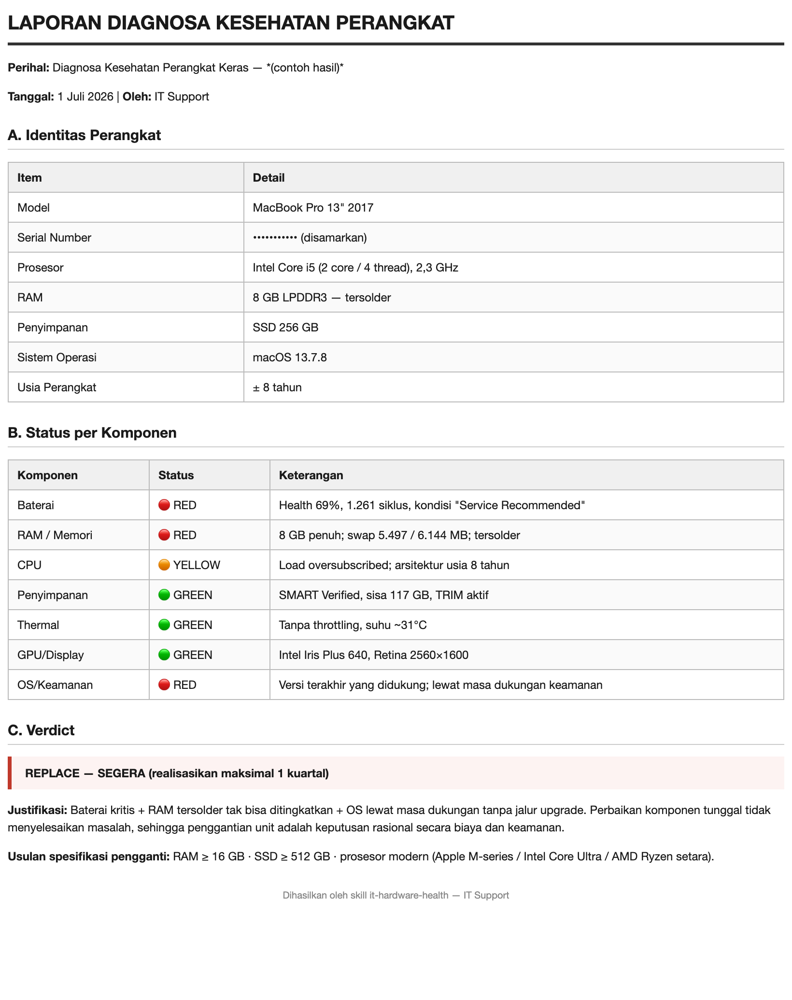

<p align="center">
  
</p>

<h1 align="center">IT Tools — Marketplace Plugin Claude Code</h1>

<p align="center">
  
  
  
  
  
</p>

<p align="center">
  Kumpulan tools IT Support untuk <a href="https://claude.com/claude-code">Claude Code</a>.<br>
  Repo ini adalah <b>marketplace publik</b> — <b>siapa saja</b> bisa memasang plugin di bawah ini,
  tanpa perlu undangan atau akses khusus.
</p>

## Plugin yang tersedia

| Plugin | Fungsi |
|---|---|
| **it-hardware-health** | Diagnosa perangkat keras laptop/PC (macOS, Windows, Linux), analisa kesehatan komponen, laporan + verdict *repair-vs-replace*, dan ekspor PDF ke Desktop. |

---

## Contoh Hasil Diagnosa

Skill menghasilkan laporan berisi tabel status per komponen (🟢 sehat / 🟠 perhatian /
🔴 kritis), analisa, dan **verdict** *KEEP / REPAIR / REPLACE* — siap diekspor ke PDF.

<p align="center">
  
</p>

<p align="center"><sub>Contoh laporan (serial number disamarkan).</sub></p>

---

## Prasyarat

- **Node.js 18+** (untuk menjalankan Claude Code via `npx`). Cek dengan `node -v`.
  Jika belum ada, unduh dari <https://nodejs.org> (pilih versi LTS).

## Menjalankan Claude Code

Pilih salah satu:

**A. Via `npx` (tanpa install global — disarankan untuk mencoba cepat):**
```bash
npx @anthropic-ai/claude-code
```
Perintah ini mengunduh & menjalankan Claude Code sekali jalan, tanpa memasang permanen.

**B. Install global (bila sering dipakai):**
```bash
npm install -g @anthropic-ai/claude-code
claude
```

> Cara Claude Code dijalankan (`npx` atau global) **tidak memengaruhi plugin** —
> perintah `/plugin` di bawah bekerja sama persis di keduanya.

## Cara Pakai (untuk semua pengguna)

Karena repo ini publik, **siapa pun** dapat memasangnya — baik anggota tim IT maupun
pengguna umum. Langkah dan perintahnya sama untuk semua orang.

Setelah Claude Code terbuka, jalankan di dalam sesinya:

```
/plugin marketplace add ryanzulham/it-tools
/plugin install it-hardware-health@it-tools
```

Menjalankan sendiri salinan repo ini di Git internal (GitLab/Bitbucket/self-hosted)?
Gunakan URL lengkap, mis.:

```
/plugin marketplace add https://git.perusahaan.co.id/it/it-tools.git
```

Setelah terpasang, skill aktif otomatis. Cukup minta, misalnya:

- "diagnosa laptop"
- "cek kesehatan PC ini"
- "apakah laptop ini perlu diganti?"
- "buatkan laporan kondisi komputer dan ekspor ke PDF"
- "buatkan memo pengajuan ganti laptop ke HRD"

### Ringkasan alur lengkap (via npx)

```bash
# 1. Jalankan Claude Code (butuh Node.js 18+)
npx @anthropic-ai/claude-code

# 2. Di dalam sesi Claude Code, ketik:
#    /plugin marketplace add ryanzulham/it-tools
#    /plugin install it-hardware-health@it-tools

# 3. Lalu minta, misalnya:
#    "diagnosa laptop saya dan ekspor ke PDF"
```

## Update

Saat plugin diperbarui (maintainer `git push`), pengguna menarik versi terbaru dengan:

```
/plugin marketplace update it-tools
```

## Untuk Maintainer (cara publish pertama kali)

```bash
cd it-tools
git init
git add .
git commit -m "Add it-hardware-health plugin"
git branch -M main
git remote add origin <URL-REPO-GIT-ANDA>
git push -u origin main
```

Selesai. Bagikan dua baris perintah `/plugin ...` di atas ke tim.

## Struktur Repo

```
it-tools/
├── .claude-plugin/
│   └── marketplace.json           # daftar plugin di marketplace ini
├── plugins/
│   └── it-hardware-health/
│       ├── .claude-plugin/
│       │   └── plugin.json         # manifest plugin
│       └── skills/
│           └── it-hardware-health/
│               ├── SKILL.md
│               ├── scripts/        # diagnose_{macos,linux,windows}, export_pdf, md_to_html
│               ├── references/     # threshold analisa + perintah fallback
│               └── assets/         # template laporan + memo HRD
└── README.md
```

## Catatan Keamanan

Semua script diagnosa bersifat **read-only** — hanya membaca status perangkat, tidak
mengubah konfigurasi/disk/power. Ekspor PDF hanya menulis file output (default ke Desktop).
